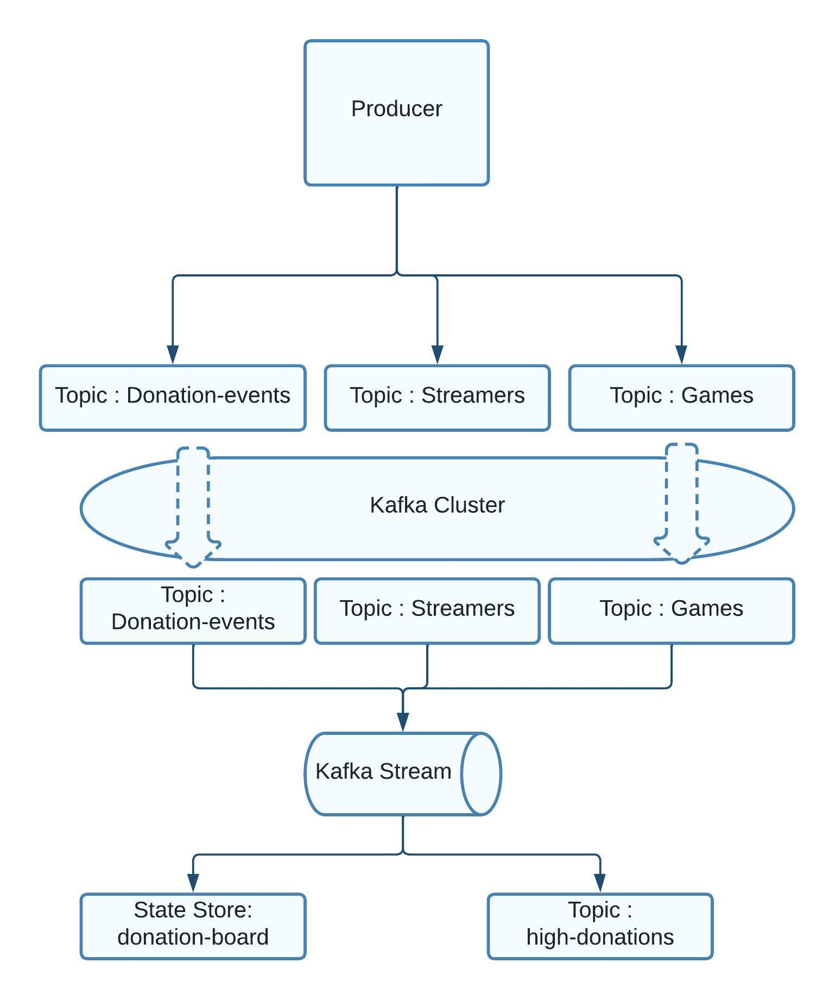

# KAFKA STATEFUL STREAMING

This project is based on the simulation of capturing live records coming from Twitch platform. <br>
We have three different topics:

1. donation-events
2. streamers
3. games

Lets suppose we want to show a ranking by game for the top 3 streamers with most donations. <br>
We can accomplish this using stateful processing in kafka streaming.

## kafka Structure



## Stream structure


### Start docker file

```
$ docker-compose up
```

### Build and run the project ranking-twitch-donation

```
$ ./gradlew build --info
$ ./gradlew run --info
```

Produce records using the files on **producers** <br>

### You can query the internal API endpoints

#### Query all the results (Grouped by game id)

```
curl -s localhost:7000/leaderboard | jq '.'
```


#### Query API by game id

```
curl -s localhost:7000/leaderboard/6 | jq '.'
```


